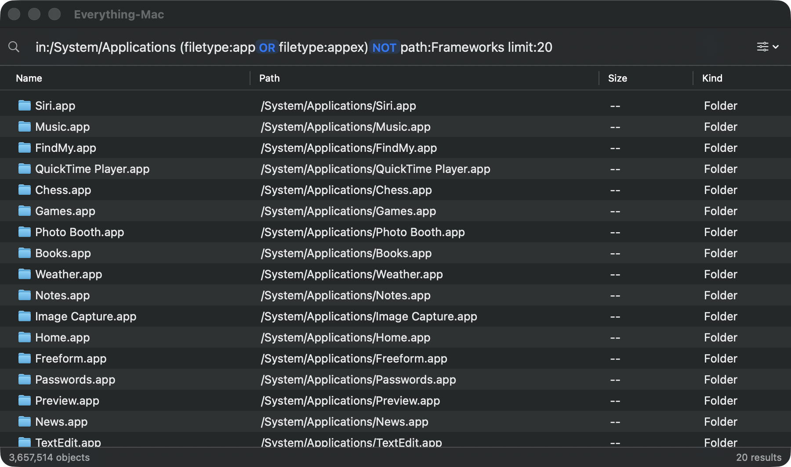
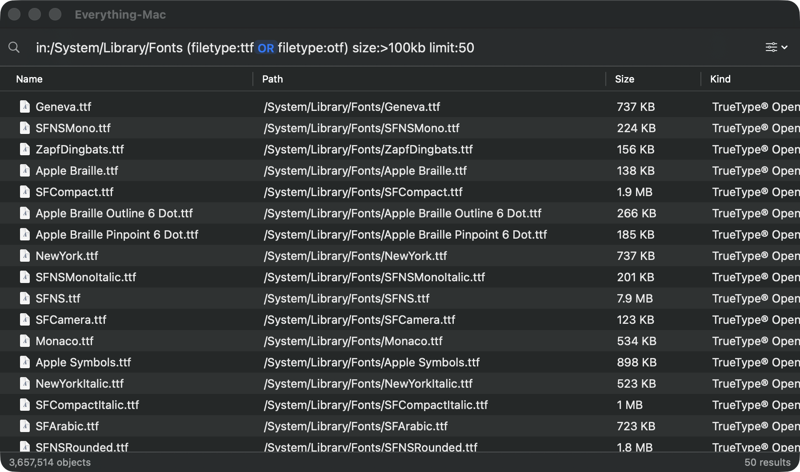

# EverythingMac

EverythingMac is a local file-name search app for macOS. It maintains an index of files and folders, then returns literal matches as you type.



The app searches local mounted volumes, stays current through FSEvents, and keeps working in the background after you close the search window. It does not rank results or search file contents.

EverythingMac supports macOS 14 Sonoma and newer.

## Install EverythingMac

Open the release DMG and drag `EverythingMac.app` into Applications. Launch the app from Applications so its background services have a stable path.

The indexing service needs Full Disk Access. In
`System Settings > Privacy & Security > Full Disk Access`, enable
`EverythingMac`. The indexing and search services are covered by that single
application entry and do not appear as separate items. When you return to
EverythingMac, it refreshes both background services so the new permission
takes effect.

EverythingMac shows a loading panel while the services start. The status bar reports progress once the first scan begins. Later launches load the saved index and replay filesystem changes.

If macOS has disabled the app's background activity, EverythingMac links to
`System Settings > General > Login Items & Extensions`, where its background
activity can be enabled again. An unresponsive registered service is repaired
and restarted automatically when the app retries the connection.

## Search for files

Enter any part of a file or folder name. Use the sliders button beside the search field to enable `Match Path`, `Match Case`, or `Match Whole Word`.

You can sort the result table by name, path, size, kind, or modification date. Double-click a result to open it. The shortcut menu can open it with another app, reveal it in Finder, copy its name or path, or move it to the Trash. Use `File > Export Results` to save the current rows as a tab-separated file.

### Filter results

Filters can appear anywhere in a query:

| Filter | Example | Result |
| --- | --- | --- |
| `in:` | `in:~/Downloads` | Items in a folder or its descendants |
| `filetype:` | `filetype:md` | Files with one of the listed extensions |
| `type:` | `type:folder` | Files or folders only |
| `size:` | `size:1mb..10mb` | Items within a size comparison or range |
| `modified:` | `modified:7d` | Items from a date or relative period |
| `path:` | `path:Sources` | Text matched against the full path |
| `name:` | `name:Package` | Text matched against the filename |
| `regex:` or `rx:` | `rx:handoff\.md$` | Names matched by a regular expression |
| `limit:` | `limit:100` | A maximum number of returned rows |

Separate terms with spaces to require all of them. Use uppercase `AND`, `OR`, `XOR`, and `NOT` for explicit Boolean expressions. Parentheses control grouping.

```text
report in:~/Documents filetype:pdf
in:~/Desktop OR in:~/Downloads
(marvel in:~/Desktop) OR (codex in:~/Downloads type:folder)
package in:~/Source NOT path:node_modules
filetype:md modified:7d size:<1mb
```

Quote values that contain spaces, such as `in:"~/Project Files"`. The editor suggests filters and operators as you type and explains invalid expressions below the field.

Regular expressions match names by default. Enable `Match Path` to apply them to full paths.



## Manage the index

Use `File > Rebuild Index` or `Settings > General > Rebuild Index Now` to scan from scratch. A forced rebuild clears the visible results before scanning begins.

The Exclude and Volumes settings control which local paths enter the index. Applying either set of changes rebuilds the cache with the new rules. EverythingMac excludes common version-control, dependency, build, and cache directories by default.

Network volumes are not indexed. A slow or unavailable share must not block local search.

## Search access

Settings > General can enable a global search shortcut. It is off by default and suggests
Control-Option-Space. EverythingMac registers the chosen physical key combination only while
the UI app runs; it does not change macOS shortcut settings or request Accessibility or Input
Monitoring permission. A registration conflict leaves the previous shortcut active.

You can also choose to show an EverythingMac menu-bar entry. The menu opens search, Settings,
or explicitly quits the UI app. Both optional access points remain available after closing the
last window. Quitting removes them while the indexing and search background services continue.

To use Shortcuts, create a shortcut, search the action library for **Search EverythingMac**,
and add that action. Set its **Query** to a search such as `filetype:pdf annual`, or choose
**Ask Each Time** for a reusable search shortcut. Running it opens EverythingMac and selects
the supplied query in its search field. Results appear in EverythingMac.

On macOS 26 or later, Spotlight can also offer **Search EverythingMac** as an action.
Open Spotlight with Command-Space, press Command-3 to narrow to actions, and search for
**Search EverythingMac**. Select the result labeled **EverythingMac**, fill in its query,
and run it. This invokes the app; it does not add the private index to Spotlight's file results.
The action has been observed in Spotlight on macOS 27; Shortcuts execution has been verified
there. macOS 14 supports the Shortcuts entry point, but its interactive execution has not yet
been verified in the compatibility runner.

Automation can open a search with the canonical URL form:

```
everythingmac://search?q=filetype%3Apdf%20annual%20report
```

URL requests reuse an open search window, or open one when needed. The URL has exactly one
percent-encoded `q` parameter. Build URLs with an encoder such as
`URLComponents`; do not substitute query text into the URL string. Shell history can retain URLs,
so avoid placing sensitive query text directly in a shell command.

## Command-line search

The bundled tool is available at `/Applications/EverythingMac.app/Contents/MacOS/everythingmac`.
Open the app once to finish setup, then enable **Settings > General > Allow command-line
searches**. The tool can query the existing index after the UI quits; it does not start the
GUI, register services, or request Full Disk Access. `--help` and `--version` work offline.
The About panel and `--version` show the semantic version and the eight-character
Git commit used to build the app, with `-dirty` when the source worktree had
local changes. Builds from source archives without Git history say `revision unknown`.

```bash
'/Applications/EverythingMac.app/Contents/MacOS/everythingmac' search --format json -- 'filetype:pdf annual'
```

For an optional user-owned command on your PATH, create a symlink only if the destination
is unused. These commands do not edit shell startup files:

```bash
mkdir -p "$HOME/.local/bin"
if [ ! -e "$HOME/.local/bin/everythingmac" ] && [ ! -L "$HOME/.local/bin/everythingmac" ]; then
  ln -s '/Applications/EverythingMac.app/Contents/MacOS/everythingmac' "$HOME/.local/bin/everythingmac"
fi
export PATH="$HOME/.local/bin:$PATH"
```

An in-place app upgrade replaces the bundled executable while keeping this symlink usable.
The installer does not create links or replace commands elsewhere on your PATH.

Command-line access is off by default. Disabling it cancels active command-line searches but
cannot recall output already received. Any local process invoking the signed tool as your
user can receive results while access is enabled.

The v1 interface is `everythingmac search [options] -- <query>`, with `--help` and
`--version`. Search accepts exactly one query argument and passes its syntax
unchanged to the app's parser. Blank queries, NUL bytes, and queries exceeding
16 KiB of UTF-8 are invalid. Quoting is the shell's responsibility.

Search options are `--format paths|json` (default `paths`), `--null` (paths
only), `--limit 1..10000` (default 1000), `--timeout` in finite positive seconds
up to 3600 (default 30), `--match-path`, `--case-sensitive`, and `--whole-word`. All
matching modifiers default to false, independently of UI preferences. Use the
existing `rx:` or `regex:` query syntax for regular expressions. Results sort
by name ascending, then by full path for equal names. A query's own limit can
lower `--limit` but cannot raise it. Output is capped; pagination and unlimited
dumps are deferred.

Paths format writes absolute paths separated by newlines. Use `--null` for NUL
delimiters when piping arbitrary filenames; filenames containing newlines need
`--null` or JSON. Status and diagnostics go to stderr, never stdout. JSON uses
this versioned shape:

```json
{"schemaVersion":1,"results":[{"path":"/file","name":"file","isDirectory":false,"sizeBytes":0,"modifiedAt":"2026-09-22T00:00:00Z"}],"returnedCount":1,"limit":1000,"truncated":false,"scanning":false}
```

`path` is absolute, `sizeBytes` is an integer or `null` if unknown, and
`modifiedAt` is a UTC RFC3339 timestamp or `null` if unknown. A size of zero
or a Unix epoch timestamp is a real value, not a missing-value marker. The synthetic root has unknown
metadata. `returnedCount` is the number of returned results; `limit` is the
effective minimum of the option and query limit. `truncated` is true only when
more matches exist beyond that limit. No total match count or durable result ID
is promised. `scanning` is true when a prior complete snapshot is searchable
while a new scan is in progress. An initial scan with no published index is an
error, including when its current record count is zero.

Exit status is 0 for a successful query, including zero or capped results; 2
for invalid arguments or query; 3 for unavailable or overloaded service,
unready index, or permission/automation denial; 4 for timeout; 5 for internal or protocol error;
and 130 for SIGINT or SIGTERM. Failure produces no partial success document.
A closed output pipe during a successful result stream exits cleanly with status
0; errors retain their exit status even if stderr is closed.

For a filename-safe pipeline in Bash or Zsh, keep NUL delimiters through each read:

```bash
everythingmac search --null --limit 100 -- 'filetype:pdf' |
  while IFS= read -r -d '' path; do
    /usr/bin/stat -f '%N: %z bytes' "$path"
  done
```

Quote the whole query to preserve Boolean operators, spaces, and regular expressions:
`everythingmac search -- '(filetype:pdf OR filetype:md) annual'` or
`everythingmac search -- 'regex:^report.*[.]pdf$'`. Put queries beginning with `-` after `--`.

Searches are admitted to the one shared index actor, with at most 32 client
connections per service, 32 requests in flight across clients, at most two
background searches, and eight per connection. Background searches use
immutable snapshots so UI searches can proceed while a command-line scan runs.
Excess requests receive an
explicit overload error. A new UI search supersedes older searches from that
same UI connection. If its active slots are full, the session keeps only the
newest UI request pending until capacity frees. Independent command-line requests use their own request IDs;
cancellation and connection loss affect only requests owned by that connection.

## Remove EverythingMac

Move `EverythingMac.app` out of Applications or into the Trash. Its removal observer stops and unregisters the indexing and search services. It also deletes the generated index.

If you created the optional `~/.local/bin/everythingmac` symlink, remove that link yourself
after checking that it still points to this app. The app does not delete user-created links.

## Build from source

Development requires macOS 14 or newer, Xcode 16 or newer, XcodeGen, SwiftLint,
and an Apple Development signing identity.

```bash
brew install xcodegen swiftlint
git clone https://github.com/mggarofalo/everything-mac.git
cd everything-mac
./scripts/build-dev.sh
```

The build script generates the Xcode project, makes a signed Release build, verifies it, and installs it in Applications. It also restarts registered services after an upgrade.

Set `LOCAL_SIGN_IDENTITY` to choose a certificate instead of using the first Apple Development identity:

```bash
LOCAL_SIGN_IDENTITY="Apple Development: Your Name (TEAMID)" \
  ./scripts/build-dev.sh
```

Use Release builds for app testing. Whole-index searches are intentionally optimized and are much slower in Debug builds.

Run the core test suite with:

```bash
swift test
```

Run the enforced complexity and coverage audit with:

```bash
./scripts/check-quality.sh
```

The quality gate runs the core and indexing-service boundary suites, caps
cyclomatic complexity at 10, requires 95% aggregate core line coverage, and
requires at least 85% line coverage in every core source file.

## Package a release

A preview DMG exercises the complete packaging flow with an Apple Development certificate. It is not notarized and is only suitable for local testing.

```bash
./scripts/build-dmg.sh --preview
```

A public build uses 2 credentials stored in macOS Keychain:

- A Developer ID Application certificate and its private key.
- A `notarytool` profile containing an app-specific password.

Create the certificate in the Apple Developer portal using a certificate signing request from Keychain Access. Install the downloaded certificate on the release Mac. Its private key must remain in Keychain and must never be committed or copied into the repository.

A Developer ID Application certificate identifies a developer team rather than one application. Reuse one certificate across applications built in the same trusted release environment. Use another certificate only when a separate machine, automation system, or organization needs an independent security boundary.

Create an app-specific password at `appleid.apple.com`, then configure the notarization profile. The command prompts for that password securely, validates it with Apple, and saves it in Keychain:

```bash
APPLE_ID="you@example.com" DEVELOPER_TEAM_ID="TEAMID" \
  ./scripts/configure-release-signing.sh
```

Do not put the app-specific password on the command line or in an environment variable. This setup is required once per release Mac, and again when the password or certificate changes.

Build the public artifact from a clean, tagged commit:

```bash
DEVELOPER_TEAM_ID="TEAMID" \
  ./scripts/build-dmg.sh --release
```

Set `NOTARY_PROFILE` if the profile is not named `everythingmac-notary`. If Keychain contains more than one valid Developer ID Application identity for the team, set `DEVELOPER_ID` to the exact identity to use.

The script validates both Keychain credentials before building. It signs the services and app, confirms the signing team, and adds the MIT license. It then signs the DMG, notarizes that outer container, staples the ticket, checks it with Gatekeeper, and writes a SHA-256 checksum under `dist/`.

Publish the DMG and checksum on the GitHub Release whose tag matches the application version. Create the release as a draft, attach both files, verify them on another Mac, then publish it. Do not publish preview DMGs.

## Understand the components

EverythingMac has 4 executable components:

| Component | Role |
| --- | --- |
| `EverythingMac.app` | Displays the interface and performs user-requested file actions |
| `everythingmac` | Sends bounded, read-only command-line queries to the search service |
| `EverythingMacSearchService` | Authenticates app/CLI clients and forwards permitted XPC requests |
| `EverythingMacIndexingService` | Scans metadata, owns the index, processes queries, and watches filesystem changes |

The `IndexCore` Swift package contains the storage, parser, search, sorting, scanning, and FSEvents code shared by the executables.

See [SECURITY.md](SECURITY.md) for the permission model, local-data protections, process trust checks, and disclosure process.

## License

EverythingMac is available under the [MIT License](LICENSE).

Its direct, literal search model is inspired by [Everything for Windows](https://www.voidtools.com/).
